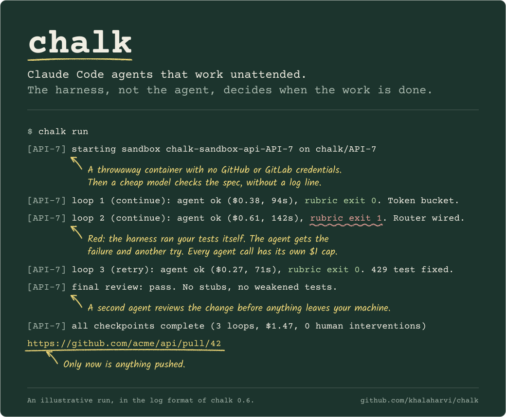
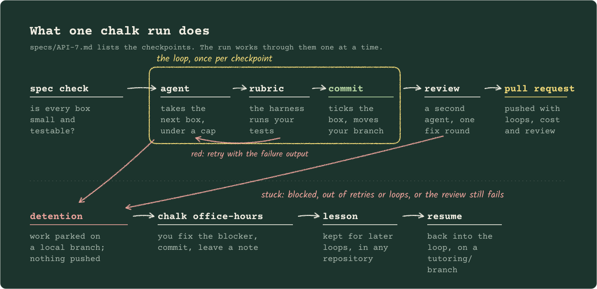

<!--
THESIS: the README proves the mechanism with an annotated run, not a feature list.
OWN-WORLD: the report card's palette (chalkboard #1c342d, chalk #f1eee3, chalk yellow #f0d878),
Courier Prime for the harness's voice, a teacher's hand (Kalam) for margin notes.
STORY: a Claude Code user sees the harness grade the agent, believes it is safe to leave
running, installs it, and runs a first ticket.
FIRST VIEWPORT: the annotated `chalk run` banner, then a three-sentence pitch and Install.
FORM: annotated transcript, candidate 6 of 7, seed ee094caf.
Art is generated: scripts/render-readme-art.py.
FINISH: unreviewed and undocumented is unfinished; this build ends with the finish review, the verdict, and DESIGN.md
-->

<p align="center">
  
</p>

<p align="center">
  <a href="https://github.com/khalaharvi/chalk/actions/workflows/ci.yml"></a>
  <a href="https://github.com/khalaharvi/chalk/releases/latest"></a>
  <a href="LICENSE"></a>
</p>

<p align="center">
  <a href="#install">Install</a> ·
  <a href="#why-chalk">Why Chalk</a> ·
  <a href="#your-first-ticket">First ticket</a> ·
  <a href="#how-a-run-works">How a run works</a> ·
  <a href="#when-an-agent-gets-stuck">When stuck</a> ·
  <a href="#see-it-get-unstuck">Demo</a> ·
  <a href="#the-vocabulary">Vocabulary</a> ·
  <a href="https://khalaharvi.github.io/chalk/"><b>Docs site</b></a>
</p>

Chalk runs Claude Code agents in disposable Docker sandboxes, one checkpoint of
your spec at a time, and runs your tests itself after every loop. Finished work
arrives as a reviewed pull request on GitHub or merge request on GitLab, with
its cost on it. A stuck agent pushes nothing: the work waits for you on a local
branch, and your fix becomes a lesson for later runs.

## Install

```sh
brew install khalaharvi/chalk/chalk
claude setup-token                   # once, with a Claude plan: prints a token
export CLAUDE_CODE_OAUTH_TOKEN=...   # that token, or ANTHROPIC_API_KEY instead
chalk doctor
```

**Use your Claude subscription or an API key.** A Pro, Max, Team or
Enterprise plan works: `claude setup-token` needs Claude Code on your
machine and prints a token that lasts a year. Runs then count against your
plan's usage limits, and `chalk fleet` runs several agents at once, so it
reaches them sooner. If `ANTHROPIC_API_KEY` is also set, it wins and the API
account is billed; unset it to use the subscription.
[More on signing in](https://khalaharvi.github.io/chalk/getting-started/#sign-in-to-claude).

You also need a Docker runtime (Docker Desktop, OrbStack or Colima) and
`gh auth login` (GitHub) or `glab auth login` (GitLab). Chalk picks the
forge from the `origin` remote: github.com means GitHub, anything else
GitLab; set `CHALK_FORGE=github` for GitHub Enterprise. For a gateway, set
`ANTHROPIC_AUTH_TOKEN` and `ANTHROPIC_BASE_URL` instead. Homebrew installs
the bash 5.3 Chalk runs under. Without Homebrew, see
[Getting started](https://khalaharvi.github.io/chalk/getting-started/#without-homebrew).

## Why Chalk

- **The harness grades the work, not the agent.** An agent saying "done" proves
  nothing. A checkpoint counts only when your test command, the
  [rubric](#rubric), passes in a run the harness starts itself. CI runs it
  again on the pull request.
- **Spend has a ceiling.** Every agent call has its own cap, and a run has a
  loop limit, so a runaway agent cannot spend without bound. The
  [report card](#report-card) shows where the money went and how much of it
  bought nothing.
- **Stuck runs have somewhere to go.** A run that cannot make progress stops in
  [detention](#detention) instead of thrashing. You fix it in
  [office hours](#office-hours) and the run carries on.
- **It all stays on your machine.** Chalk is a bash CLI. It keeps telemetry and
  lessons in a local Postgres container and collects no usage data. Your code
  goes only to the model provider you set up.

> [!NOTE]
> **Chalk is early (v0.6).** An end-to-end test covers the whole workflow with
> fake `docker`, `claude`, `gh` and `glab`, the SQL is tested against a real
> Postgres, and the Homebrew formula is tested with a real install. It has had
> few runs against real projects, so expect rough edges, and please
> [report them](https://github.com/khalaharvi/chalk/issues).

## Your first ticket

Set up the repository once:

```sh
chalk init                # adds .chalk/config, .chalk/textbook.md, CI gates, a CLAUDE.md section, specs/
$EDITOR .chalk/config     # set CHALK_TEST_CMD (the rubric) and CHALK_SETUP_CMD, e.g. npm ci
git add -A && git commit -m "Add Chalk"
```

The default sandbox image is Node 22. For Python, Go or another stack,
build an image `FROM chalk-sandbox:local` with your toolchain, set
`CHALK_IMAGE`, and set `CHALK_CI_IMAGE` for the CI rubric gate: see
[Use your own stack](https://khalaharvi.github.io/chalk/guide/configuring/your-stack/).

Then, for each ticket, create a worktree and write the spec:

```sh
chalk new API-7 "Add rate limiting"     # worktree ../<repo>.worktrees/API-7 on branch chalk/API-7
cd ../<repo>.worktrees/API-7
$EDITOR specs/API-7.md
```

A spec is a checklist. Each checkpoint should be small enough for one loop
and provable by a test:

```markdown
# API-7: Add rate limiting

## Context
Public endpoints have no rate limit. Add a token bucket per API key,
in src/middleware/. Return 429 with Retry-After when the bucket is empty.

## Checkpoints
- [ ] Token bucket with unit tests in src/middleware/limiter.ts
- [ ] Wire the limiter into the router, with a test for the 429 response
```

Commit it and start the run:

```sh
git add -A && git commit -m "spec"
chalk run                 # or: chalk run --detach, then chalk logs API-7 -f
```

## How a run works



1. **Sandbox.** A container starts with your repository cloned onto a RAM
   disk. Your repository is mounted read-only, and the container has no GitHub
   or GitLab credentials.
2. **Spec check.** A cheap model confirms each checkpoint is small, testable
   and unambiguous, and leaves the rubric passing on its own. If one is not,
   the run stops before any money goes on loops.
3. **Loops.** The agent works on the first unchecked checkpoint under the
   per-loop cap. Then the harness runs the rubric. Green, with a box ticked:
   Chalk commits and fast-forwards your local branch. Red: the agent gets the
   failure output and tries again.
4. **Review.** When every box is ticked, a second agent reviews the change for
   stubs, weakened tests and drift from the spec. Its findings get one fix
   round.
5. **Pull request.** The branch is pushed, and the pull or merge request lists
   the loops, the cost, any human help and the review summary.

The agent keeps `specs/<TICKET>.notes.md` as it works, so each loop starts
from what earlier loops learned. More in [the workflow guide](https://khalaharvi.github.io/chalk/guide/running/workflow/).

## When an agent gets stuck

A reported blocker, the loop limit, too many failed retries, or a review that
still fails all end in detention. The work is parked on a local branch and
nothing is pushed:

```sh
git switch detention/API-7-1764000000
# fix the blocker (a missing mock, a wrong assumption, an unclear spec), then commit
chalk office-hours -m "Payments client needs the sandbox base URL in tests"
```

Chalk records your note, distils it and your fix into a general lesson, and
resumes the run on a `tutoring/…` branch. Later loops are given the lessons
that match their failure, in any repository on your machine.
[How lessons are matched](https://khalaharvi.github.io/chalk/guide/configuring/lesson-memory/).

## See it get unstuck

A recording of the whole cycle: a run fails its rubric three times, a person
fixes it, and the resumed run opens a merge request.

<a href="docs/assets/demo.svg"></a>

<details>
<summary>Transcript of the recording (simulated with the test fakes; select the image to play it)</summary>

```text
shop $ chalk new SHOP-7 "Add a discount code field"
created /home/sam/shop.worktrees/SHOP-7 on branch chalk/SHOP-7
shop $ cd ../shop.worktrees/SHOP-7
SHOP-7 $ # Spec written and committed: two checkpoints. Each loop leaves a stray file.
SHOP-7 $ chalk run
[SHOP-7] loop 1 (continue): agent ok ($0.25, 0s), rubric exit 1. did the thing
[SHOP-7] loop 2 (retry): agent ok ($0.25, 0s), rubric exit 1. did the thing
[SHOP-7] loop 3 (retry): agent ok ($0.25, 1s), rubric exit 1. did the thing
[SHOP-7] DETENTION: rubric failed (exit 1)
[SHOP-7] next: the rubric still fails after 2 retries; fix the failure in /home/sam/.local/state/chalk/shop/runs/SHOP-7/io/rubric.log, or make the checkpoint smaller
[SHOP-7] work parked on local branch detention/SHOP-7-1791171685. To unblock: …
SHOP-7 $ git switch -q detention/SHOP-7-1791171685
SHOP-7 $ git rm -q BROKEN && git commit -q -m "Remove the stray BROKEN file"
SHOP-7 $ chalk office-hours -m "Never commit scratch files such as BROKEN"
lesson: Distilled: never commit a BROKEN marker
lesson recorded; continuing on tutoring/SHOP-7-1791171689
[SHOP-7] loop 1 (continue): agent ok ($0.25, 0s), rubric exit 0. implemented a checkpoint
[SHOP-7] loop 2 (continue): agent ok ($0.25, 0s), rubric exit 0. implemented a checkpoint
[SHOP-7] final review: pass. Looks complete.
[SHOP-7] all checkpoints complete (5 loops, $2.00, 1 human interventions)
https://gitlab.example.com/acme/shop/-/merge_requests/42
```

The full transcript is in [docs/assets/demo.txt](docs/assets/demo.txt);
`make demo` records it again.

</details>

## Run an epic in parallel

```sh
chalk fleet PROJ-900      # Claude drafts a plan from the epic, you confirm it, agents start in the background
chalk status              # runs, cost and detentions
```

Chalk reads the epic through your Jira MCP server, or from a plan you write
yourself. See [Fleet plans](https://khalaharvi.github.io/chalk/guide/running/fleet/).

## The vocabulary

Chalk borrows its words from school. Each one names a specific mechanism; the
[glossary](https://khalaharvi.github.io/chalk/reference/glossary/) has the rest.

| Term | What it is | Where you meet it |
| :-- | :-- | :-- |
| <a id="spec"></a>**Spec** | The ticket as a checklist of small, testable checkpoints | `specs/<TICKET>.md` |
| <a id="rubric"></a>**Rubric** | Your test command. The harness runs it after every loop, and CI runs it again | `CHALK_TEST_CMD` |
| <a id="textbook"></a>**Textbook** | Rules every agent in this repository is given, added to its system prompt | `.chalk/textbook.md` |
| <a id="loop"></a>**Loop** | One agent attempt at the next checkpoint, under its own spend cap | `CHALK_BUDGET_USD` |
| <a id="detention"></a>**Detention** | Where a stuck run stops. The work is kept on a local branch and nothing is pushed | `detention/<TICKET>-<time>` |
| <a id="office-hours"></a>**Office hours** | You fix the blocker, leave a note, and the run resumes | `chalk office-hours -m` |
| <a id="tutoring"></a>**Tutoring** | The branch a resumed run continues on | `tutoring/<TICKET>-<time>` |
| <a id="lesson"></a>**Lesson** | Your fix, distilled into advice that later loops are given | `chalk db psql`, table `lessons` |
| **[Report card](#report-card)** | A local HTML page: spend, wasted loops, and what to tune | `chalk dashboard` |
| <a id="end-of-sprint"></a>**End of sprint** | Stop runs, remove sandboxes and worktrees, delete merged branches | `chalk cleanup` |

## Report card

<picture>
  <source media="(prefers-color-scheme: dark)" srcset="docs/assets/report-card-dark.png">
  
</picture>

*Sample data, not from a real run.* `chalk dashboard` builds this page
from the telemetry on your machine: the cost per finished checkpoint, the
share of spend that made no progress, what each kind of call costs, the
tests that keep failing, and
notes on what to tune. Nothing is sent anywhere.

## Commands

```text
Setup
  chalk doctor                 Check tools, auth, database and sandbox image
  chalk init                   Add Chalk config, textbook and CI gates to this repo
  chalk db up|down|psql        Manage the local telemetry database
  chalk db upgrade [--cleanup] Move the database to Postgres 17, then drop the old one
  chalk sandbox build          Build the default sandbox image
  chalk prompts [eject NAME]   List the prompts, or copy one into the repo to edit

Work
  chalk new TICKET [title]     Create a worktree, branch and spec for one ticket
  chalk check                  Check that the current spec is ready for an agent
  chalk run [--detach]         Run the agent loop for the current worktree
  chalk fleet EPIC [--plan F] [--yes]
                               Split an epic into workstreams and run them in parallel
  chalk status                 Show runs, cost and detentions for this repo
  chalk logs TICKET [-f]       Show a run log
  chalk dashboard [--days N]   Open the report card: spend, waste and what to tune

Failure lifecycle
  chalk office-hours -m NOTE [--detach]
                               Record your fix on a detention branch and resume
  chalk submit                 Push the current branch and open the pull/merge request
  chalk cleanup [--all]        Stop runs, remove sandboxes, worktrees, merged branches
```

## For teams

`chalk init` also adds a CI gate: `.github/workflows/chalk.yml` on GitHub, or
`.gitlab/chalk.gitlab-ci.yml` on GitLab. On pull or merge requests from Chalk
branches it fails when the spec has unfinished checkpoints, re-runs the rubric
outside the agent's sandbox, and can write a row to a central audit table.
Make those checks required and require an approving review: the gates show
the checks passed, and the approval shows a person read the diff.

Every agent call is recorded with its kind, model, prompt set, cost, tokens
and outcome. Together with the log of human interventions, that is evidence
for an ISO/IEC 42001 management system, though Chalk alone does not make a
team compliant. See [Pull and merge request gates](https://khalaharvi.github.io/chalk/guide/operating/merge-request-gates/).

## Documentation

- **Guide:** [the workflow](https://khalaharvi.github.io/chalk/guide/running/workflow/),
  [detention and office hours](https://khalaharvi.github.io/chalk/guide/running/failures/),
  [configuration](https://khalaharvi.github.io/chalk/guide/configuring/configuration/)
  (every `.chalk/config` key), [your own stack](https://khalaharvi.github.io/chalk/guide/configuring/your-stack/),
  [permissions](https://khalaharvi.github.io/chalk/guide/configuring/permissions/),
  [prompts](https://khalaharvi.github.io/chalk/guide/configuring/prompts/),
  [lesson recall](https://khalaharvi.github.io/chalk/guide/configuring/lesson-memory/),
  [verdicts and the report card](https://khalaharvi.github.io/chalk/guide/operating/dashboard/),
  [pull and merge request gates](https://khalaharvi.github.io/chalk/guide/operating/merge-request-gates/)
- **Reference:** [commands](https://khalaharvi.github.io/chalk/reference/commands/),
  [glossary of the school terms](https://khalaharvi.github.io/chalk/reference/glossary/),
  [roadmap](docs/roadmap.md)
- **Develop:** [architecture](https://khalaharvi.github.io/chalk/develop/architecture/),
  [testing](https://khalaharvi.github.io/chalk/develop/testing/),
  [bash style](docs/bash-style.md),
  [releasing](https://khalaharvi.github.io/chalk/develop/releasing/)

The site is built from [`docs/`](docs/) by `make docs`.

## Contributing

Chalk is small on purpose: one bash CLI, no build step. Run `make check` with
bash 5.3 first on your `PATH`. Setup and pull request steps are in
[CONTRIBUTING.md](CONTRIBUTING.md), the code conventions in
[docs/bash-style.md](docs/bash-style.md), and security reports go through
[SECURITY.md](SECURITY.md).

## License

Apache-2.0. See [LICENSE](LICENSE).
