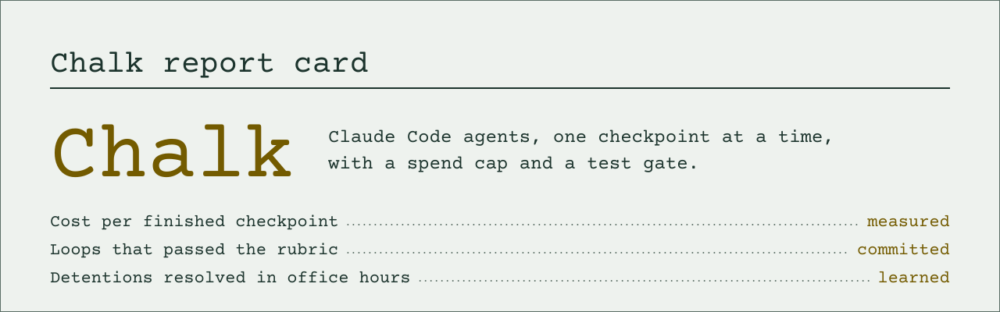
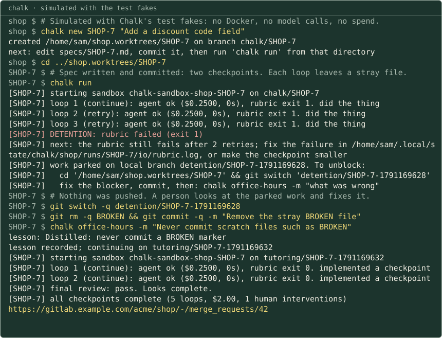
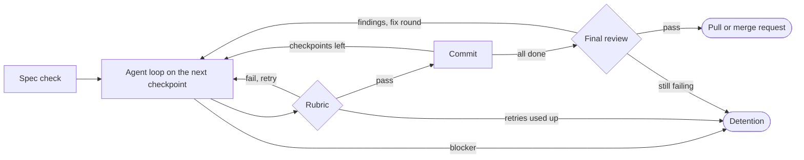
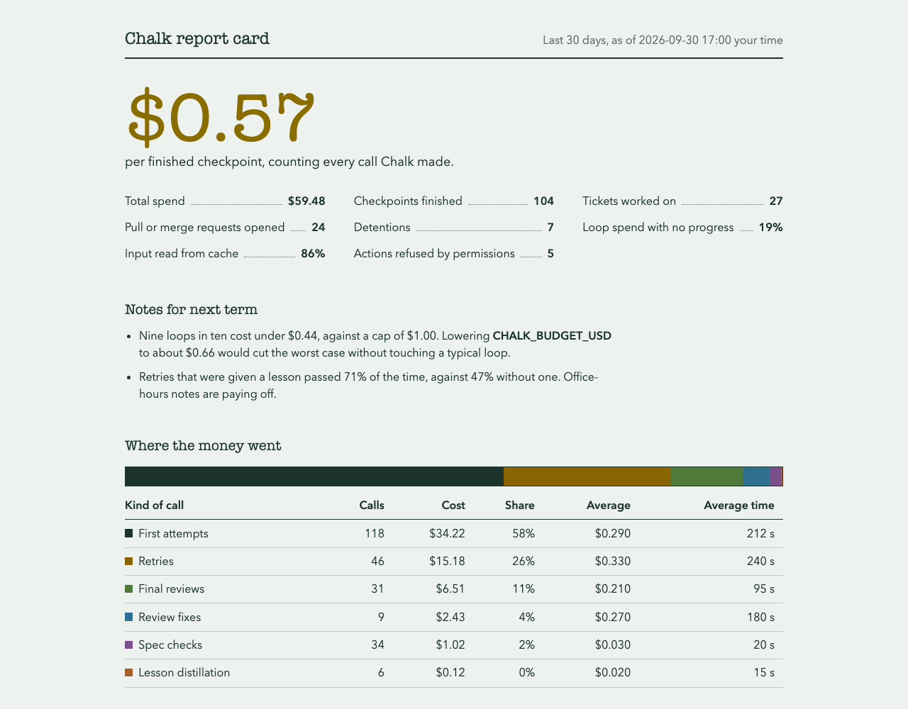

<picture>
  <source media="(prefers-color-scheme: dark)" srcset="docs/assets/banner-dark.svg">
  
</picture>

Chalk runs Claude Code agents in disposable sandboxes on your GitHub or
GitLab repositories, one small checkpoint at a time, with a spend cap per
loop and a test gate the harness runs itself. An agent that gets stuck
stops and waits for a person; finished work arrives as a pull or merge
request.

Early: covered by end-to-end tests with fakes; few real-world runs yet.
Please [report rough edges](https://github.com/khalaharvi/chalk/issues).

[](https://github.com/khalaharvi/chalk/actions/workflows/ci.yml)
[](https://github.com/khalaharvi/chalk/releases)
[](LICENSE)

**Documentation: [khalaharvi.github.io/chalk](https://khalaharvi.github.io/chalk/)**

<a href="docs/assets/demo.svg"></a>

<details>
<summary>Transcript of the recording (simulated with the test fakes; select the image to play it)</summary>

```text
shop $ chalk new SHOP-7 "Add a discount code field"
created /home/sam/shop.worktrees/SHOP-7 on branch chalk/SHOP-7
shop $ cd ../shop.worktrees/SHOP-7
SHOP-7 $ # Spec written and committed: two checkpoints. Each loop leaves a stray file.
SHOP-7 $ chalk run
[SHOP-7] loop 1 (continue): agent ok ($0.2500, 0s), rubric exit 1. did the thing
[SHOP-7] loop 2 (retry): agent ok ($0.2500, 0s), rubric exit 1. did the thing
[SHOP-7] loop 3 (retry): agent ok ($0.2500, 0s), rubric exit 1. did the thing
[SHOP-7] DETENTION: rubric failed (exit 1)
[SHOP-7] next: the rubric still fails after 2 retries; fix the failure in /home/sam/.local/state/chalk/shop/runs/SHOP-7/io/rubric.log, or make the checkpoint smaller
[SHOP-7] work parked on local branch detention/SHOP-7-1791169628. To unblock: …
SHOP-7 $ git switch -q detention/SHOP-7-1791169628
SHOP-7 $ git rm -q BROKEN && git commit -q -m "Remove the stray BROKEN file"
SHOP-7 $ chalk office-hours -m "Never commit scratch files such as BROKEN"
lesson: Distilled: never commit a BROKEN marker
lesson recorded; continuing on tutoring/SHOP-7-1791169632
[SHOP-7] loop 1 (continue): agent ok ($0.2500, 0s), rubric exit 0. implemented a checkpoint
[SHOP-7] loop 2 (continue): agent ok ($0.2500, 0s), rubric exit 0. implemented a checkpoint
[SHOP-7] final review: pass. Looks complete.
[SHOP-7] all checkpoints complete (5 loops, $2.00, 1 human interventions)
https://gitlab.example.com/acme/shop/-/merge_requests/42
```

The full transcript is in [docs/assets/demo.txt](docs/assets/demo.txt);
`make demo` records it again.

</details>

## Install

```sh
brew install khalaharvi/chalk/chalk
export CLAUDE_CODE_OAUTH_TOKEN=...   # or ANTHROPIC_API_KEY, or ANTHROPIC_AUTH_TOKEN + ANTHROPIC_BASE_URL for a gateway
chalk doctor
```

You also need a Docker runtime (Docker Desktop, OrbStack or Colima) and
`gh auth login` (GitHub) or `glab auth login` (GitLab). Chalk picks the
forge from the `origin` remote: github.com means GitHub, anything else
GitLab; set `CHALK_FORGE=github` for GitHub Enterprise. Homebrew installs
the bash 5.3 Chalk runs under. Without Homebrew, see
[Getting started](https://khalaharvi.github.io/chalk/getting-started/#without-homebrew).

## Quick start

```sh
chalk init                               # adds .chalk/config, .chalk/textbook.md, CI gates, a CLAUDE.md section, specs/
$EDITOR .chalk/config                    # set CHALK_TEST_CMD (the rubric) and CHALK_SETUP_CMD
git add -A && git commit -m "Add Chalk"

chalk new PROJ-123 "Add rate limiting"   # worktree ../<repo>.worktrees/PROJ-123 on branch chalk/PROJ-123
cd ../<repo>.worktrees/PROJ-123
$EDITOR specs/PROJ-123.md                # write the checkpoints
git add -A && git commit -m "spec"
chalk run                                # or: chalk run --detach
```

For an epic, `chalk fleet PROJ-900` drafts a plan, asks you to confirm,
and runs the tickets in parallel. When a run stops in detention, fix the
blocker on its branch and run `chalk office-hours -m "what was wrong"`.

## How a run works



1. Starts a container with the repository cloned into a RAM disk. The host
   repository is mounted read-only. The container has no GitHub or GitLab
   credentials. Inside it, the agent runs in Claude Code's auto mode.
2. Spec check: a cheap model confirms every checkpoint is small, testable
   and unambiguous. If not, the run stops before any money is spent on
   loops. Run it alone with `chalk check`.
3. Each loop: the agent works on the first unchecked checkpoint under a
   `CHALK_BUDGET_USD` cap and reports `done` or `blocked`. The harness then
   runs the rubric itself.
4. Rubric passes and a checkpoint was ticked: the harness commits and
   fast-forwards your local branch. Otherwise the agent gets the failure
   output and a retry prompt, up to `CHALK_MAX_RETRIES`.
5. All checkpoints done: an independent agent reviews the change for
   stubs, weakened tests and drift from the spec. Findings get one fix
   round (`CHALK_REVIEW_ROUNDS`) and a second review.
6. Review passes: the branch is pushed and a pull or merge request is
   opened with loops, cost, human interventions and the review summary.
7. A reported blocker, the loop limit, exhausted retries or a review that
   still fails: **detention**. Nothing is pushed; the work is parked on a
   local `detention/…` branch until a person resolves it in office hours,
   and their note becomes a lesson for later loops.

## Report card

<picture>
  <source media="(prefers-color-scheme: dark)" srcset="docs/assets/report-card-dark.png">
  
</picture>

*Sample data, not from a real run.* `chalk dashboard` builds this page
from the telemetry on your machine: the cost per finished checkpoint, the
share of spend that made no progress, what each kind of call costs, the
tests that keep failing, and
notes on what to tune. Nothing is sent anywhere.

## Documentation

- **Guide:** [the workflow](https://khalaharvi.github.io/chalk/guide/running/workflow/),
  [detention and office hours](https://khalaharvi.github.io/chalk/guide/running/failures/),
  [configuration](https://khalaharvi.github.io/chalk/guide/configuring/configuration/)
  (every `.chalk/config` key), [permissions](https://khalaharvi.github.io/chalk/guide/configuring/permissions/),
  [prompts](https://khalaharvi.github.io/chalk/guide/configuring/prompts/),
  [lesson recall](https://khalaharvi.github.io/chalk/guide/configuring/lesson-memory/),
  [verdicts and the report card](https://khalaharvi.github.io/chalk/guide/operating/dashboard/),
  [pull and merge request gates](https://khalaharvi.github.io/chalk/guide/operating/merge-request-gates/)
- **Reference:** [commands](https://khalaharvi.github.io/chalk/reference/commands/),
  [glossary of the school terms](https://khalaharvi.github.io/chalk/reference/glossary/),
  [roadmap](docs/roadmap.md)
- **Develop:** [architecture](https://khalaharvi.github.io/chalk/develop/architecture/),
  [testing](https://khalaharvi.github.io/chalk/develop/testing/),
  [bash style](docs/bash-style.md),
  [releasing](https://khalaharvi.github.io/chalk/develop/releasing/)

The site is built from [`docs/`](docs/) by `make docs`.

## Contributing and security

See [CONTRIBUTING.md](CONTRIBUTING.md) and [SECURITY.md](SECURITY.md).

## License

Apache-2.0. See [LICENSE](LICENSE).
