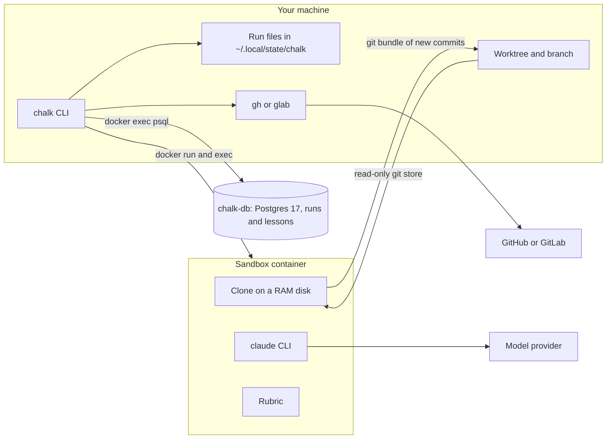

# Architecture

Chalk is one Bash CLI with no build step: `bin/chalk` loads the modules in
`lib/` and dispatches a command. It runs on your machine and drives three
things: a sandbox container per run, one Postgres container for telemetry
and lessons, and the forge's CLI.

## Components

1. On your machine, `chalk` works in a worktree on the ticket's branch and
   keeps each run's prompts, answers and logs under
   `~/.local/state/chalk/<repo>/`.
2. Each run starts a sandbox container. The repository's git store is
   mounted read-only and cloned into a RAM disk inside it; `claude` and
   the rubric run only there.
3. The only thing that leaves the sandbox is a git bundle of new commits,
   which `chalk` fast-forwards onto the branch.
4. `claude` in the sandbox talks to the model provider. The sandbox has no
   GitHub or GitLab credentials.
5. `chalk` records every call in `chalk-db`, one Postgres container per
   machine reached only through `docker exec`, which also holds the
   lessons.
6. Only the host pushes and opens pull or merge requests, through `gh` or
   `glab`.
7. Optionally, `chalk` asks a [decider](../guide/configuring/decider.md)
   bounded questions over HTTP: by default the local reference service on
   127.0.0.1 (strands-decider and chalk-embed, on the host, never in the
   sandbox), or a hosted one.

## What each file owns

Modules load in layers; a file uses only what is loaded before it
(see [Bash style](../bash-style.md#layers)).

| Layer | File | Owns |
| :-- | :-- | :-- |
| Entry | `bin/chalk` | Finds bash 5.3, loads the modules, prints usage, dispatches commands |
| Runtime | `lib/core/guard.sh` | Bash 3.2 code that re-runs Chalk under bash 5.3 or newer |
| | `lib/core/log.sh` | `info`, `warn`, `die` |
| | `lib/core/runtime.sh` | Strict settings, the error and signal traps, `need`, `bash_at_least` |
| | `lib/core/jobs.sh` | Named background jobs, each with its own log |
| | `lib/core/system.sh` | The host profile (CPUs, memory, Docker resources), locks, adaptive timeouts |
| Domain | `lib/repo.sh` | The repository, worktrees, ticket keys, specs |
| | `lib/forge.sh` | GitHub or GitLab: which CLI, opening the request |
| | `lib/state.sh` | Per-repository run directories and pid files |
| | `lib/config.sh` | `.chalk/config`, defaults, environment, validation |
| | `lib/db.sh` | The `chalk-db` container, recording calls, lessons, the dashboard query, `chalk db upgrade` |
| | `lib/decider.sh` | The [decider](../guide/configuring/decider.md): its protocol client and per-loop time budget, the stuck question, the lesson rerank, and the local service (`chalk decider up`, `down`, `status`) |
| | `lib/memory.sh` | Lesson recall for prompts |
| | `lib/sandbox.sh` | Sandbox containers, the image, the scripts run inside |
| | `lib/fingerprint.sh` | Loop fingerprints and verdicts |
| | `lib/agent.sh` | Agent calls, prompts, answer schemas, `chalk prompts` |
| Commands | `lib/run.sh` | The loop: `chalk run`, `check`, `status`, `logs` |
| | `lib/fleet.sh` | `chalk new` and `chalk fleet` |
| | `lib/lifecycle.sh` | `chalk office-hours`, `submit`, `cleanup` |
| | `lib/dashboard.sh` | `chalk dashboard` |
| | `lib/setup.sh` | `chalk doctor` and `chalk init` |

Outside `lib/`:

| Path | What it holds |
| :-- | :-- |
| `share/sandbox/` | The default sandbox image and the bash 5.2 scripts that run inside it |
| `share/prompts/` | Every prompt the agents receive |
| `share/templates/` | Files `chalk init` adds to a repository |
| `share/schema.sql`, `share/dashboard.sql`, `share/dashboard.html` | The telemetry schema, the report card's query and page |
| `share/decider/chalk-embed.py` | The local embedding service for semantic recall, a single Python file run with `uv run --script` |
| `share/ci-audit-schema.sql` | The optional central audit table |
| `packaging/`, `scripts/release.sh`, `scripts/update-tap.sh`, `scripts/changelog.sh`, `CHANGELOG.md` | The Homebrew formula template, release scripts and the changelog |
| `scripts/check-commit-title.sh` | The Conventional Commits check on pull request titles |
| `scripts/ci-db-upgrade.sh` | A real Postgres 16 to 17 upgrade test, run in CI |
| `scripts/install-bash.sh`, `scripts/lint-conventions.sh`, `scripts/check-sandbox-syntax.sh` | Toolchain and lint |
| `scripts/demo.sh`, `scripts/render-demo.py`, `scripts/render-banner.py`, `scripts/render-readme-art.py`, `scripts/screenshots.sh` | The recording and images on this site and in the README |
| `scripts/mkdocs_hooks.py`, `scripts/check-links.sh`, `mkdocs.yml`, `docs/` | This site |
| `tests/unit/`, `tests/e2e.sh`, `tests/fakes/` | Tests; see [Testing](testing.md) |

## A run, traced

`chalk run` is `cmd_run` in `lib/run.sh`:

1. **`run_context`** resolves the worktree, branch, ticket and spec into
   `RUN_*` globals and calls **`load_config`**. It refuses uncommitted
   changes.
2. **`run_claim`** checks for Docker, `jq` and credentials, and that no
   other run of the ticket is alive, then clears `io/`.
3. **`run_open_sandbox`** records the pid, sets the teardown trap and calls
   **`run_start_services`**, which starts **`db_up`** and
   **`sandbox_ensure_image`** side by side with `jobs_spawn`. Then
   **`agent_write_system`** writes the system prompt, **`sandbox_start`**
   starts the container and **`sandbox_clone`** clones the branch inside.
4. `CHALK_SETUP_CMD` runs through **`sandbox_sh`**, and
   **`run_spec_check`** asks the cheap model about the spec.
5. Each loop: **`run_build_prompt`** writes the prompt, with lessons from
   **`memory_recall`**; **`run_call`** → **`agent_call`** runs `claude`
   in the sandbox; **`run_rubric`** runs the rubric;
   **`run_fingerprint`** → **`fp_compute`** reduces the loop to its
   fingerprint; a passing loop is committed with **`sandbox_commit`** and
   brought home with **`run_sync`** (a bundle, fast-forward only);
   **`run_verdict`** → **`fp_verdict`** labels a loop without progress;
   **`db_record_call`** records the call.
6. With every checkpoint ticked, **`run_review`** runs the final review,
   and **`run_graduate`** pushes and calls **`forge_open_request`**.
7. A run that cannot progress ends in **`run_detain`**, which parks the
   work with **`sandbox_export`** and logs **`db_open_lesson`**.

`chalk office-hours` (`cmd_office_hours` in `lib/lifecycle.sh`) checks it
is on a detention branch, runs **`office_hours_distill`** in a short-lived
sandbox, records the note with **`db_resolve_lesson`**, switches to a
`tutoring/` branch and calls `cmd_run` again, or **`run_graduate`** when
nothing is left to do.
