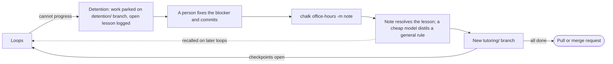

# Detention and office hours

When a run cannot make progress, it stops and waits for a person instead
of spending more. That stop is **detention**. The person fixes the
blocker and explains it in **office hours**; the explanation becomes a
**lesson** that later loops are given, in any repository on your machine.

## What sends a run to detention

Every detention prints the reason, then one `next:` line that says what to
do about it.

| Reason in the log | What happened | What `next:` says |
| :-- | :-- | :-- |
| `agent reported a blocker` | The agent answered `blocked`, for example for a missing credential or a contradiction in the spec. Retrying cannot fix that, so there is no retry. | Provide what the agent asked for (printed above it): a credential, access or a decision |
| `rubric failed (exit N)` | The rubric failed on `CHALK_MAX_RETRIES` + 1 loops in a row. | Fix the failure in `io/rubric.log`, or make the checkpoint smaller |
| `agent stopped early (...)` | Retries ran out, and the last loop's Claude Code call ended with an error, for example at the spend cap. | See why in `io/loop.json`; if it ran out of budget, raise `CHALK_BUDGET_USD` |
| `rubric passed but no checkpoint was ticked in the spec` | Retries ran out, and the last loop left the tests passing without finishing a checkpoint. | Tick it if it is done, or make it testable |
| `loop limit of N reached with M checkpoints open` | The run used `CHALK_MAX_LOOPS` loops. | Split the open checkpoints, or raise `CHALK_MAX_LOOPS` |
| `final review still finds problems after N fix round(s)` | The final review failed again after `CHALK_REVIEW_ROUNDS` fix rounds. The findings are printed. | Fix the findings, or raise `CHALK_REVIEW_ROUNDS` |
| `deja_vu: …` | Only with `CHALK_FP_RULES=on`: the loop fails like an open detention of another ticket. | Fix that ticket, which it names, first |
| `repeat: …` | Only with `CHALK_FP_RULES=on`: the same failing change as the loop before. | Fix the failure yourself; a retry would repeat it |
| `no_change: …` | Only with `CHALK_FP_RULES=on`: the agent changed nothing. | Make the checkpoint clearer, or do the step yourself |

The verdicts are explained in [Verdicts](../operating/dashboard.md#verdicts).
Whatever the reason, when the last loop had three or more actions refused
by permission checks, `next:` says so and points to `chalk doctor` instead:
that is what a loop looks like when auto mode is unavailable for the model
(see [Permissions](../configuring/permissions.md#auto-mode-requirements)).

## What detention does

- **Nothing is pushed.** The sandbox's work, including the failed attempt,
  is committed and parked on a local branch,
  `detention/<TICKET>-<timestamp>` (with `-2`, `-3` and so on when one
  ticket is detained twice in the same second). Your `chalk/<TICKET>` branch keeps only
  the loops that passed.
- **The failure is logged** in the `lessons` table as an open lesson:
  the reason, and the last 40 lines of the rubric's output or the
  blocker. When the rubric failed, the loop's fingerprint and first error
  are stored with it, so a later failure of the same kind can be matched.
- **The log says how to continue:**

```text
[PROJ-123] DETENTION: rubric failed (exit 1)
[PROJ-123] next: the rubric still fails after 2 retries; fix the failure in …/runs/PROJ-123/io/rubric.log, or make the checkpoint smaller
[PROJ-123] work parked on local branch detention/PROJ-123-1764000000. To unblock:
[PROJ-123]   cd '/home/sam/shop.worktrees/PROJ-123' && git switch 'detention/PROJ-123-1764000000'
[PROJ-123]   fix the blocker, commit, then: chalk office-hours -m "what was wrong"
```

## Office hours

```sh
git switch detention/PROJ-123-1764000000
# fix the blocker (missing mock, wrong assumption, unclear spec), commit
chalk office-hours -m "Payments client needs the sandbox base URL in tests"
```

`chalk office-hours` must be run from a `detention/…` branch. It:

1. **Records your note** as the resolution of the open lesson, with your
   git email. This is the record of human intervention that the pull or
   merge request reports.
2. **Distils a lesson.** With `CHALK_DISTILL=true` (the default), a cheap
   model in a short-lived, read-only sandbox reads the failure, your note
   and your fix (the diff since the detention commit), and writes a
   general rule. If that fails, your note is still kept and used as the
   lesson.
3. **Moves to a tutoring branch**, `tutoring/<TICKET>-<timestamp>`, so the
   detention branch stays as it was.
4. **Resumes the run** if the spec still has open checkpoints, or opens the
   pull or merge request if your fix finished it. `--detach` resumes in the
   background.

The [gates](../operating/merge-request-gates.md) treat `tutoring/*`
branches like `chalk/*` branches.

### Writing a useful note

The note is what later loops are told, so describe the cause and the
fix, not the symptom:

- Good: "Payments client needs the sandbox base URL in tests; set
  `PAYMENTS_URL` in `tests/setup.ts`."
- Less useful: "tests were failing".

Rules that should apply to every ticket from now on belong in the
textbook instead.

## The failure lifecycle



1. Loops run until the run cannot progress, then it goes to detention:
   the work is parked on a `detention/` branch and an open lesson is
   logged with the failure.
2. A person switches to that branch, fixes the blocker and commits.
3. `chalk office-hours -m "…"` records the note as the lesson's
   resolution, and a cheap model distils it, with the fix, into a general
   rule.
4. Chalk moves to a new `tutoring/` branch. If checkpoints are still open,
   the loops resume there; if not, the pull or merge request opens.
5. From then on, resolved lessons are [recalled](../configuring/lesson-memory.md)
   into the prompts of later loops whose failures look the same.

## Giving up on a ticket

A detention branch stays until you delete it. `chalk cleanup` keeps
branches that are neither merged nor pushed; `chalk cleanup --all` deletes
them, detention work included.
