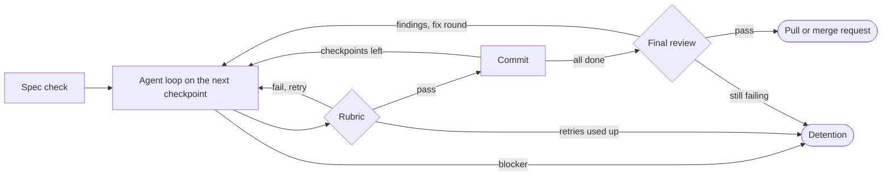

# Chalk harness


Chalk runs Claude Code agents in disposable sandboxes, one small checkpoint
at a time. Each loop has a spend cap, the harness runs your tests itself
before anything is committed, and an agent that gets stuck stops and waits
for a person instead of spending more. Finished work arrives as a GitHub
pull request or a GitLab merge request.

!!! note "Status: early"
    The whole workflow is covered by end-to-end tests with fake `docker`,
    `claude`, `gh` and `glab`, and the SQL is tested against a real
    Postgres. Chalk has had few runs against real projects yet, so expect
    rough edges and please
    [report them](https://github.com/khalaharvi/chalk/issues).

## Where to start

- **New to Chalk:** [Getting started](getting-started.md) installs it, sets
  up a repository and runs a first ticket.
- **Running tickets:** [The workflow](guide/running/workflow.md), then
  [Detention and office hours](guide/running/failures.md) for when a run
  gets stuck.
- **Tuning:** [Configuration](guide/configuring/configuration.md) lists
  every setting; [the report card](guide/operating/dashboard.md) shows
  what to change.
- **The words:** Chalk names its parts after school. The
  [glossary](reference/glossary.md) says what each one means; on every page,
  a term with a dotted underline shows its definition when you hover over it.
- **Contributing:** [Architecture](develop/architecture.md) says where each
  part of a run lives, and [Testing](develop/testing.md) how to check a
  change without Docker or spend.

## How a run works



1. Chalk starts a container with your branch cloned into a RAM disk. The
   container has no GitHub or GitLab credentials.
2. A cheap model checks that every checkpoint in the spec is small,
   testable and unambiguous. If not, the run stops before any loop is paid
   for.
3. Each loop, the agent works on the next unchecked checkpoint under a
   spend cap. Then the harness runs the rubric, your test command, itself.
4. When the rubric passes and a checkpoint was ticked, the harness commits
   the work to your local branch. Otherwise the agent gets the failure and
   tries again, up to a retry limit.
5. When every checkpoint is done, an independent agent reviews the change.
   Its findings get one fix round.
6. A passing review opens the pull or merge request.
7. A reported blocker, exhausted retries, the loop limit or a review that
   still fails sends the run to detention: nothing is pushed, the work is
   parked on a local branch, and a person takes over in office hours.

## A run that needs help

This recording runs the real `chalk` against the test fakes, so it is free
and the same every time. The agent keeps leaving a stray file that the
rubric rejects; after three loops the run goes to detention, a person
removes the file and explains it in office hours, and the resumed run
finishes and opens a merge request.

[{ .chalk-demo }](assets/demo.svg)

Select the image to play the recording.

??? info "Transcript"

    ```text
    --8<-- "docs/assets/demo.txt"
    ```

## The report card

`chalk dashboard` builds one HTML page from the telemetry on your machine:
the cost per finished checkpoint, the share of spend that made no progress,
and notes on what to tune. Nothing is sent anywhere.


*Sample data, not from a real run. See
[Verdicts and the report card](guide/operating/dashboard.md).*
